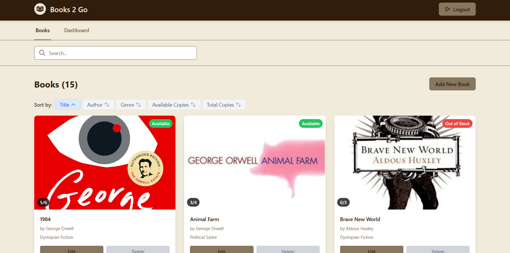

# Books 2 Go

A full-stack library management system built with Ruby on Rails (backend) and React (frontend) with comprehensive testing coverage.



## Features

- **Authentication**: User registration and login with JWT-based authentication
- **Role-Based Access**: Different dashboards for Librarians and Members
- **Book Management**: Add, edit, delete, and search books (Librarian only)
- **Image Management**: Upload, update, and remove book cover images with validation
- **Borrowing System**: Members can borrow and return books with overdue tracking
- **Dashboard**: Real-time statistics and borrowing management
- **Responsive Design**: Modern UI built with Tailwind CSS
- **Comprehensive Testing**: Full test coverage for both frontend and backend

## Tech Stack

### Backend

- Ruby on Rails 8.0.2 (API mode)
- SQLite database (for easy development setup)
- JWT authentication
- Active Storage for image handling
- Rack-CORS for cross-origin requests
- RSpec for testing

### Frontend

- React 18
- Tailwind CSS for styling
- Axios for API communication
- Jest + React Testing Library for testing

## Prerequisites

- Ruby 3.0+
- Node.js 16+
- Rails 8.0.2

## Quick Start

### Prerequisites

Before you begin, make sure you have the following installed:

- **Ruby 3.0+** (recommended: 3.3.0)
- **Node.js 16+**
- **Rails 8.0.2** (will be installed via bundler)

### 1. Clone and Setup

```bash
# Clone the repository
git clone git@github.com:abouhid2/books2go.git
cd books2go/

# Make the setup script executable
chmod +x setup.sh

# Run the setup script (this will take a few minutes)
./setup.sh
```

**What the setup script does automatically:**

- ✅ Installs Ruby dependencies (`bundle install`)
- ✅ Creates missing configuration files (`database.yml`, `application.yml`)
- ✅ Sets up the database with demo data
- ✅ Regenerates Rails binstubs (fixes common Rails command issues)
- ✅ Installs Node.js dependencies
- ✅ Creates demo users and books for testing

### 2. Start the Application

**Open two terminal windows/tabs:**

**Terminal 1 - Start the Rails API server:**

```bash
bundle exec rails server -p 3001
```

**Terminal 2 - Start the React frontend:**

```bash
cd client
npm start
```

> **💡 Pro Tip**: Always use `bundle exec` before Rails commands to ensure you're using the correct gem versions from your Gemfile.

### 3. Access the Application

Once both servers are running, you can access:

- **Frontend (React App)**: http://localhost:3000
- **Backend API**: http://localhost:3001

**Login with the demo credentials:**

- **Librarian**: `librarian@library.com` / `password123`
- **Member**: `member@library.com` / `password123`

### 4. What You'll See

The application includes:

- 📚 **15 demo books** with cover images
- 👥 **5 demo users** (1 librarian, 4 members)
- 📖 **16 active borrowings** for testing
- ⏰ **3 overdue borrowings** to test overdue functionality

## Troubleshooting

### Common Issues

**1. "Rails command not found" or "Binstub error"**

```bash
# The setup script should fix this automatically, but if you encounter issues:
bundle exec rails app:update:bin
bundle exec rails --version
```

**2. "Database connection error"**

```bash
# Recreate the database
bundle exec rails db:drop db:create db:migrate db:seed
```

**3. "Port already in use"**

```bash
# Kill the existing process or use a different port
bundle exec rails server -p 3002
```

**4. "Node modules not found"**

```bash
# Reinstall Node dependencies
cd client
rm -rf node_modules package-lock.json
npm install
```

**5. "Permission denied" on setup script**

```bash
# Make sure the script is executable
chmod +x setup.sh
```

### Manual Setup (Alternative)

If the setup script fails, you can set up manually:

#### Install Ruby Dependencies

```bash
bundle install
```

#### Fix Rails Binstubs (Important!)

```bash
bundle exec rails app:update:bin
```

#### Database Setup

```bash
bundle exec rails db:create
bundle exec rails db:migrate
bundle exec rails db:seed
```

#### Install Node Dependencies

```bash
cd client
npm install
```

#### Start the Application

```bash
# Terminal 1
bundle exec rails server -p 3001

# Terminal 2
cd client && npm start
```

## API Endpoints

### Authentication

- `POST /api/auth/login` - User login
- `POST /api/auth/register` - User registration
- `POST /api/auth/logout` - User logout
- `GET /api/auth/me` - Get current user info

### Books

- `GET /api/books` - List all books (with search and filtering)
- `POST /api/books` - Create new book (Librarian only)
- `GET /api/books/:id` - Get book details
- `PUT /api/books/:id` - Update book (Librarian only)
- `DELETE /api/books/:id` - Delete book (Librarian only)

**Image Management:**

- Upload images when creating books (JPEG, PNG, GIF, WebP, max 5MB)
- Update book images via PUT request
- Remove images by setting image parameter to `nil` or empty string
- Images are automatically processed and URLs are included in book responses:
  - `image_url`: Full-size image URL
  - `thumbnail_url`: 200x200px thumbnail URL

### Borrowings

- `GET /api/borrowings` - List borrowings
- `GET /api/borrowings/:id` - Get specific borrowing details
- `POST /api/borrowings` - Create borrowing
- `PATCH /api/borrowings/:id/return` - Return book
- `GET /api/borrowings/overdue` - Get all overdue borrowings (Librarian only)
- `GET /api/borrowings/my_overdue` - Get user's overdue borrowings

### Dashboard

- `GET /api/dashboard/librarian` - Librarian dashboard statistics
- `GET /api/dashboard/member` - Member dashboard statistics

## Testing

### Running Tests

#### Backend Tests (RSpec)

```bash
# Run all backend tests
bundle exec rspec

# Run specific test categories
bundle exec rspec spec/models/           # Model tests only
bundle exec rspec spec/controllers/      # Controller tests only
bundle exec rspec spec/requests/         # Request tests only

# Run with detailed output
bundle exec rspec --format documentation

# Run specific test file
bundle exec rspec spec/controllers/api/books_controller_spec.rb

# Run with coverage report (generates HTML report in coverage/ directory)
bundle exec rspec --format documentation

# you can open it with the command
xdg-open coverage/index.html
```

#### Frontend Tests (Jest)

```bash
cd client

# Run all frontend tests
npm test

# Run tests in watch mode (recommended for development)
npm test -- --watch

# Run tests once
npm test -- --watchAll=false

# Run with coverage report
npm test -- --coverage --watchAll=false

# Run specific test file
npm test -- Dashboard.test.js

# Generate coverage report
npm test -- --coverage --watchAll=false
```

### Test Coverage

The project has comprehensive test coverage with:

#### Backend Test Coverage

- **Model Tests**: Data validations, associations, business logic, image handling
- **Controller Tests**: API endpoints, authentication, authorization, image upload/update/removal
- **Request Tests**: Full API integration testing
- **Factory Tests**: Test data generation
- **Code Coverage**: 97.15% line coverage (307/316 lines covered)

**Coverage Breakdown by File:**

- `app/controllers/api/books_controller.rb`: 100.00% (35/35 lines)
- `app/controllers/api/borrowings_controller.rb`: 100.00% (35/35 lines)
- `app/controllers/api/dashboard_controller.rb`: 100.00% (35/35 lines)
- `app/controllers/api/auth_controller.rb`: 96.30% (26/27 lines)
- `app/controllers/api/application_controller.rb`: 94.29% (33/35 lines)
- `app/models/book.rb`: 100.00% (35/35 lines)
- `app/models/user.rb`: 100.00% (35/35 lines)
- `app/models/borrowing.rb`: 100.00% (35/35 lines)

#### Frontend Test Coverage

- **Component Tests**: UI rendering, user interactions, accessibility
- **Hook Tests**: State management, API integration
- **Integration Tests**: Component interactions, form submissions

## Test Statistics

| Category                | Test Files | Test Suites | Individual Tests | Type              |
| ----------------------- | ---------- | ----------- | ---------------- | ----------------- |
| **Backend Models**      | 5          | 5           | 30               | Unit Tests        |
| **Backend Controllers** | 4          | 4           | 55               | Unit Tests        |
| **Backend Requests**    | 4          | 4           | 20               | Integration Tests |
| **Backend Factories**   | 3          | 3           | 5                | Unit Tests        |
| **Frontend Components** | 7          | 7           | 86               | Unit Tests        |
| **Frontend Hooks**      | 2          | 2           | 40               | Unit Tests        |
| **Frontend App**        | 1          | 1           | 2                | Unit Tests        |
| **Total**               | **26**     | **26**      | **238**          | **Mixed**         |

**Actual Test Results:**

- **Backend (RSpec)**: 340 examples, 0 failures
- **Frontend (Jest)**: 241 tests, 16 test suites, 8 failures (in useBookForm tests)
- **Combined Total**: 581 individual tests across 42 test suites

### Test Files Breakdown

#### Backend (RSpec)

- **Model Tests**: `user_spec.rb`, `book_spec.rb`, `borrowing_spec.rb`, `user_borrowing_spec.rb`, `book_borrowing_spec.rb`
- **Controller Tests**: `auth_controller_spec.rb`, `books_controller_spec.rb`, `borrowings_controller_spec.rb`, `dashboard_controller_spec.rb`
- **Request Tests**: `auth_spec.rb`, `books_spec.rb`, `borrowings_spec.rb`, `users_spec.rb`, `dashboard_spec.rb`
- **Factories**: `users.rb`, `books.rb`, `borrowings.rb`

#### Frontend (Jest)

- **Component Tests**: `Dashboard.test.js`, `DashboardHeader.test.js`, `DashboardStats.test.js`, `BorrowingsList.test.js`, `BorrowingsTable.test.js`, `ErrorDisplay.test.js`, `Notification.test.js`, `BookForm.test.js`, `SearchBar.test.js`, `SortControl.test.js`
- **Hook Tests**: `useBorrowings.test.js`, `useDashboard.test.js`, `useBookForm.test.js`, `useFormErrors.test.js`, `useSorting.test.js`
- **App Tests**: `App.test.js`

### Image Functionality Tests

The backend includes comprehensive tests for the new image functionality:

- **Image Upload Tests**: Creating books with images, validation (file size, type)
- **Image Update Tests**: Replacing existing images, removing images
- **Image Display Tests**: URL generation for full-size and thumbnail images
- **Image Validation Tests**: File size limits (5MB), supported formats (JPEG, PNG, GIF, WebP)

## Project Structure

```
Books2Go/
├── app/
│   ├── controllers/
│   │   ├── api/
│   │   │   ├── application_controller.rb
│   │   │   ├── auth_controller.rb
│   │   │   ├── books_controller.rb
│   │   │   ├── borrowings_controller.rb
│   │   │   └── dashboard_controller.rb
│   │   └── application_controller.rb
│   ├── models/
│   │   ├── application_record.rb
│   │   ├── book.rb
│   │   ├── borrowing.rb
│   │   └── user.rb
│   └── storage/                    # Active Storage for images
├── client/
│   ├── src/
│   │   ├── components/
│   │   │   ├── common/
│   │   │   │   └── LoadingSpinner.js
│   │   │   ├── __tests__/
│   │   │   │   ├── ErrorDisplay.test.js
│   │   │   │   ├── Notification.test.js
│   │   │   │   ├── SearchBar.test.js
│   │   │   │   └── SortControl.test.js
│   │   │   ├── ColorPalette.js
│   │   │   ├── DashboardLayout.js
│   │   │   ├── Header.js
│   │   │   ├── MainContent.js
│   │   │   ├── NavigationTabs.js
│   │   │   ├── Notification.js
│   │   │   └── SearchBar.js
│   │   ├── features/
│   │   │   ├── auth/
│   │   │   │   ├── components/
│   │   │   │   │   ├── AuthForm.js
│   │   │   │   │   ├── Login.js
│   │   │   │   │   └── ModeToggle.js
│   │   │   │   └── hooks/
│   │   │   │       └── useAuth.js
│   │   │   └── books/
│   │   │       ├── components/
│   │   │       │   ├── __tests__/
│   │   │       │   │   ├── BookForm.test.js
│   │   │       │   │   ├── BorrowingsList.test.js
│   │   │       │   │   ├── BorrowingsTable.test.js
│   │   │       │   │   ├── Dashboard.test.js
│   │   │       │   │   ├── DashboardHeader.test.js
│   │   │       │   │   └── DashboardStats.test.js
│   │   │       │   ├── book-grid/
│   │   │       │   ├── dashboard/
│   │   │       │   ├── form/
│   │   │       │   ├── BookForm.js
│   │   │       │   ├── BookHeader.js
│   │   │       │   ├── Books.js
│   │   │       │   └── Dashboard.js
│   │   │       └── hooks/
│   │   │           ├── __tests__/
│   │   │           │   ├── useBookForm.test.js
│   │   │           │   ├── useBorrowings.test.js
│   │   │           │   ├── useDashboard.test.js
│   │   │           │   └── useFormErrors.test.js
│   │   │           ├── useBookForm.js
│   │   │           ├── useBooks.js
│   │   │           ├── useBorrowings.js
│   │   │           ├── useDashboard.js
│   │   │           ├── useFormErrors.js
│   │   │           └── useSorting.js
│   │   ├── services/
│   │   │   └── api.js
│   │   └── App.js
│   └── package.json
├── spec/
│   ├── controllers/
│   │   └── api/
│   │       ├── auth_controller_spec.rb
│   │       ├── books_controller_spec.rb
│   │       ├── borrowings_controller_spec.rb
│   │       └── dashboard_controller_spec.rb
│   ├── models/
│   │   ├── book_spec.rb
│   │   ├── borrowing_spec.rb
│   │   ├── user_spec.rb
│   │   ├── user_borrowing_spec.rb
│   │   └── book_borrowing_spec.rb
│   ├── requests/
│   │   └── api/
│   │       ├── auth_spec.rb
│   │       ├── books_spec.rb
│   │       ├── borrowings_spec.rb
│   │       └── users_spec.rb
│   ├── factories/
│   │   ├── books.rb
│   │   ├── borrowings.rb
│   │   └── users.rb
│   └── fixtures/
│       └── files/                  # Test images for image functionality
├── config/
│   ├── database.yml
│   ├── routes.rb
│   └── initializers/
│       └── cors.rb
└── README.md
```

## Contributing

1. Fork the repository
2. Create a feature branch
3. Make your changes
4. Add tests for new functionality
5. Ensure all tests pass
6. Submit a pull request

## License

This project is licensed under the MIT License.
